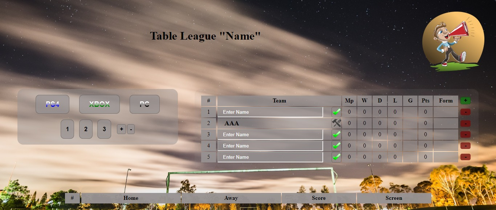

# Angular Fifa Table
**_Using Angular Cli, I created a table for virtual clubs at EA Sports FIFA. I created in my own way TO-DO-LIST APP._**

## Table of contents
* [Getting Started](#getting-started)
* [Screenshots](#screenshots)
* [Technologies](#technologies)
* [Development server](#development-server)
* [Code scaffolding](#code-scaffolding)
* [Build](#build)
* [Running unit tests](#running-unit-tests)
* [Running end-to-end tests](#running-end-to-end-tests)
* [Status](#status)
* [Author](#author)

## Getting Started
I have a big fondness for virtual clubs at EA Sports FIFA, which is why I decided to create an automated point counting website. Unfortunately, I do not have enough advanced knowledge to complete it now. I decided to stop.

## Screenshots

## Technologies
* [Angular CLI](https://github.com/angular/angular-cli) version 7.2.2.

## Development server

Run `ng serve` for a dev server. Navigate to `http://localhost:4200/`. The app will automatically reload if you change any of the source files.

## Code scaffolding

Run `ng generate component component-name` to generate a new component. You can also use `ng generate directive|pipe|service|class|guard|interface|enum|module`.

## Build

Run `ng build` to build the project. The build artifacts will be stored in the `dist/` directory. Use the `--prod` flag for a production build.

## Running unit tests

Run `ng test` to execute the unit tests via [Karma](https://karma-runner.github.io).

## Running end-to-end tests

Run `ng e2e` to execute the end-to-end tests via [Protractor](http://www.protractortest.org/).

## Status
To improve

## Author
Created by **_cookavsky_** [Angular](https://angulartable.cookavsky.com/) - for friends Polska Panda.